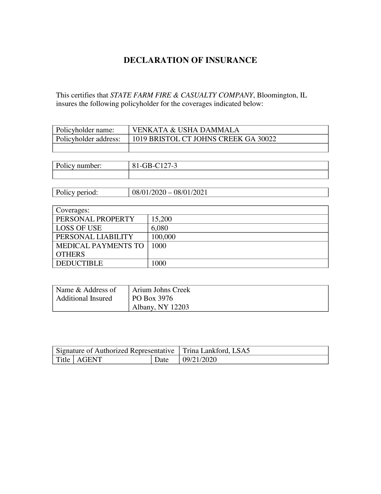

# Processing Server for PICK-PyTorch
Processing Server based on Updated version of PyTorch PICK model ["PICK: Processing Key Information Extraction from Documents using Improved Graph 
Learning-Convolutional Networks"](https://arxiv.org/abs/2004.07464) (ICPR 2020). 

The server utilizes the pretrained model from [pick_update_03](https://git.azcltd.com/review_group/rnd-ec-insurance-recognition/-/tree/gorodetsky_dev/experiments/pick_update_03).

## Requirements
* python = 3.6 
* torchvision = 0.6.1
* tabulate = 0.8.7
* overrides = 3.0.0
* opencv_python = 4.3.0.36
* numpy = 1.16.4
* pandas = 1.0.5
* allennlp = 1.0.0
* torchtext = 0.6.0
* tqdm = 4.47.0
* torch = 1.5.1
* pytesseract = 0.3.8
* urllib3 = 1.26.4
* flask = 1.1.2
```bash
sudo apt-get install tesseract-ocr
pip install -r requirements.txt
```
Note, server requires weights of the pretrained PICK model saved as 'pretrained_model/pretrained.pth'.

### Usage
Run server:
```bash
python get_entities_server.py -d cpu
```
Use '-d' to specify device for calculations ('cpu' or 'cuda').

Request processing:
```bash
python request_processing.py -i input_examples/t0_sf_c1_0_0.jpg -o same
```
Use '-i' to specify path for input image and '-o' for output JSON file. Use '-o same' to save output file to same directory and name as input file.

### Example
Input image:
<div align="center">
  
</div>

Output JSON file:
```bash
{
    "Type": "declaration of insurance",
    "Address": "1019 bristol ct johns creek ga",
    "Zip Code": "30022",
    "First Name": "venkata usha",
    "Last Name": "dammala",
    "Additionall Interest": "arium johns creek po box 3976 albany ny 12203",
    "Policy Number": "81-gb-c127-3",
    "Carrier": "state farm fire casualty company",
    "Liability Limit": "100000",
    "Premium": "",
    "Effective Date": "08/01/2020",
    "Expiration Date": "08/01/2021",
    "Print Date": "09/21/2020"
}
```
